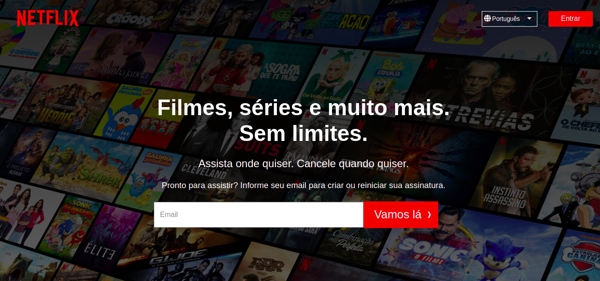

# Clone Netflix



# Tecnologias

<ul>
    <li>ReactJS</li>
    <li>Pré-processador Sass</li>
</ul>

# Como executar

Clone o projeto em seu dispositivo e acesse a pasta do mesmo.

```
$ git clone https://github.com/Lara123-pg/CloneNetflix.git
$ cd CloneNetflix
$ code .  (Abrir o Visual Studio Code)
```

Logo em seguida, o projeto estará em seu editor para ser executado.

# Projeto

Clone Netflix é um projeto que tem o objetivo treinar os conceitos Frontend com o ReactJS e de ínicio foi criado a parte inicial da página da Netflix.

# Autor

Lara Fernanda

Email: lamorimalvescavalcante@gmail.com

# Licença

Este projeto está sob a licença MIT - https://github.com/Lara123-pg/CloneNetflix/blob/main/LICENSE
